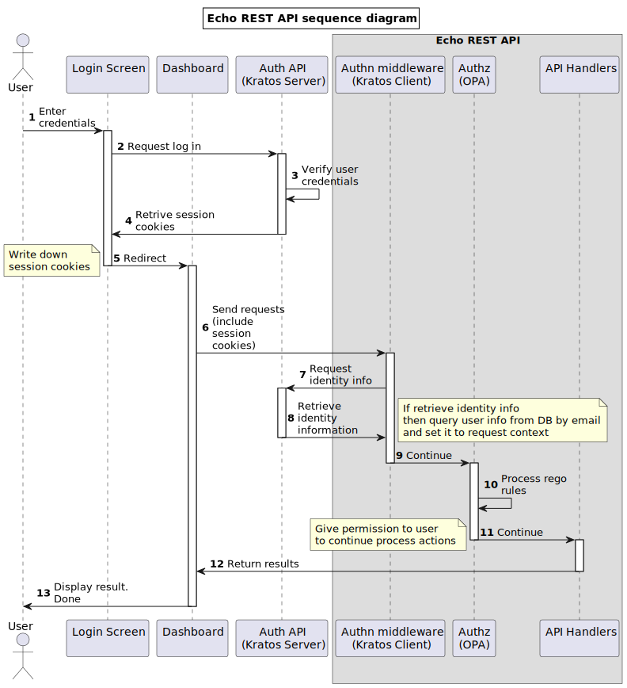

# Echo Rest API boilerplate

A Golang restful API boilerplate based on Echo framework v4. Includes tools for module generation, db migration, authorization, authentication and more.

## Overview

## Used libraries:

- labstack/echo 
- open-policy-agent/opa 
- uber-go/dig
- spf13/cobra 
- jackc/pgx 
- ory/kratos
- golang-migrate/migrate

## Features

- [x] User Auth functionality (Signup, Login, Forgot Password, Reset Password) use Ory/Kratos
- [x] REST API
- [x] DB Migration
- [x] Configs via environmental variables
- [x] Unit tests
- [x] Dependency injection
- [x] Role based access control (use Open Policy Agent)
- [x] Module generation, quickly create model, usecase, api handler

## Refs

## TODOs

- [x] Update docker compose for ory/kratos
- [ ] Update README.md
- [ ] Write more tests
- [ ] Add support Heroku
